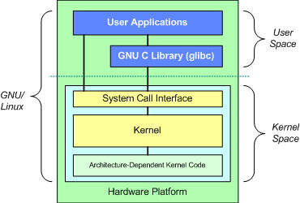

# Author's Notes

To open the VS Code for this project, I must open the Ubuntu 24.04 and run 

```bash
cd GitHub/creation_of_ai/my_ai/
source .venv/bin/activate
code .
```

And to run a script, we can't use the VS Code terminal, we have to use the Ubuntu terminal by running 

```bash
python3 parent_directory/python_script.py
```

We did so many things and I'm too tired to write anything right now. Will recap tomorrow :( from beginning.

Recap needed: 
- how to open VS Code via Ubuntu to reduce cross-pollination conflict between Windows and WSL2. (https://gemini.google.com/app/71891f1c6e94441f)
- how the program said no numpy module when I just installed it. This is because I had to reactivate the venv since the installed numpy was done in the previous Ubuntu terminal, which was done in the venv. 
- how I need to install "unzip" with "sudo apt-get install unzip" because "curl -fsSL https://fnm.vercel.app/install | bash" can't install fnm because of missing dependencies, specifically, unzip and not curl.
- problem with running cargo run -- (main.rs)

AI engineering has 4 important layers:

1. **System Foundation:** This includes OS, shell, git, editor, GPU drivers, etc.
2. **Package Managers:** uv, pnpm, cargo, juliaup.
3. **Language Runtimes:** Python 3.11+, Node 20+, Rust, Julia
4. **AI/ML Libraries:** PyTorch, JAX, transformers, etc.

# System Foundation

Even though I already have **Ubuntu** installed years ago, it may not be the same version that Rohit wanted. So, I decided to install an entirely new one. There are some terms one must understand first.

One can think of **UNIX** as the original blueprint/architecture and design philosophy of how modern computers should behave which then begets **Linux**, a modern and free recreation of the aforementioned blueprint. They first named it the Linux **Kernel**, a core engine which manages hardware and connects them to OS. And as for **Ubuntu**, it is a user-friendly product built on top of Linux. So, we have the following diagram!



When our code does something, it talks to the Kernel which then handles the hardware. The **GNU C Library (glibc)** is the foundational software package that provides the standard helper functions for the C programming language on Linux-based systems. The **System Call Interface (SCI)** is the boundary separating the user space from the kernel space. Even though we may write code in many languages, the Linux Kernel doesn't care about it at all. It understands only some specific *hardware requests*, these are called **System Calls**. The SCI is the standardized list of these available calls. 

## Ubuntu 24.04 and WSL2 upgrade

Rohit required me to install Ubuntu 24.04. This can be done by running 

```batch
# powershell
wsl --install -d Ubuntu-24.04
```

**WSL** is short for **Windows Subsystem for Linux**. It is a feature of Microosoft that allows us to run Linux OS (like Ubuntu, Debian, Kali) on our Windows computer without requiring a **virtual machine**. There are two versions of WSL: **WSL1** and **WSL2**. The thing is that for our project to operate smoothly, the WSL should be version 2 so we could download the Python packages with `uv`. First, let us check the version of our WSL.

```batch
# powershell
wsl --version
``` 

By running this script, I found that my WSL version is 2.7.3.0. However, if I run 

```batch
# powershell
wsl --list --verbose
```

I will find that my Ubuntu and my Ubuntu 24.04 is running on the older architecture: WSL1. I have to upgrade it (specifically, for Ubuntu 24.04). This can be done by running 

```batch
# powershell
wsl --set-version Ubuntu-24.04 2

# wait for the process to finish then run this line to check
wsl --list --verbose
```

## System Foundation

With WSL upgraded and Ubuntu 24.04 installed, we can now run the code below in Ubuntu 24.04 terminal. 

```bash
sudo apt update
```
This line will check my system and see how many things I could upgrade. It didn't actually install or upgrade anything; it simply refreshed my system's "shopping list" of available software. I don't actually need to upgrade anything because the course didn't require it, but to keep things up-to-date, I simply upgraded it all by running

```bash
sudo apt upgrade -y
```

This code took a lot of time (tens of minutes), but once it was done, my system is up-to-date. After that, I ran

```bash
sudo apt install -y build-essential git curl wget
```

as instructed. This script installs the tools necessary for this course, `git`, `curl`, and `wget`. 

- The `-y` is noting that I will say yes to the terminal and it asked for my permission/whether I want to proceed or not. 
- The `build-essential` package is a meta-package on Debian-based Linux systems (like Ubuntu) that automatically installs all the necessary tools needed to compile and build software from source code. It acts as a convenient shortcut rather than manually tracking down and downloading individual compiler tools..
- The `git` is an open-source distributed version control system designed to track changes in source code during software development.
- Both `curl` (Client URL) and `wget` (World Wide Web get) are command-line utilities used to download data from internet servers. However, they are built for fundamentally different workflows.

## Python with UV, Node.js, Julia, Rust

Rohit claimed that `uv` works 10-100x faster than `pip` and handles **virtual environments** automatically. A virtual environment is an isolated, self-contained directory that holds a specific version of a programming language (like Python) along with its associated libraries and dependencies. It prevents software version conflicts and keeps your main operating system clean. We shall first run 

```bash
curl -LsSf https://astral.sh/uv/install.sh | sh
```

`curl` is the tool that is used to transfer data from the network/website into my computer and the flag `-LsSf` tells the command to follow redirects, fails silently, and shows progress bar. Then the downloaded stuff will be re-directed/piped to the shell, the program that takes the command I type into my terminal and sends it to the computer OS. After this, we will install Python and activate the virtual environment so that whatever we downloaded here will not mess with the files or packages in other projects. Essentially, we're creating a confined space to work where we can do whatever the hell we want without messing up things else where.

```bash
uv python install 3.12

uv venv
source .venv/bin/activate

uv pip install numpy matplotlib jupyter
```

Note that it is very important that we activated the virtual environment because our packages were installed within this virtual environment. If we do not activate it and open VS Code, the python will not recognize the presumably downloaded packages because it wasn't open in the virtual environment. To check whether the installed python is actually correct and where it is located, we will run

```bash
which -a python3 && python3 --version
```

We shall now install **Node.js** for TypeScript lessons.

```bash
curl -fsSL https://fnm.vercel.app/install | bash
```

When we run the command above, it might say that `Checking availability of curl... OK!` but `Checking availability of unzip... Missing!`. We will have to install `unzip` package (we can also install `zip` along with it) by running 

```bash
sudo apt-get install zip
sudo apt-get install unzip
```

Then we can run the `curl -fsSL ...` installation of `fnm` again. After running the command the terminal suggested, we can proceed with 

```bash
fnm install 22
fnm use 22

npm install -g pnpm

node -e "console.log('Node', process.version)"
```
 
Next, we shall down load **Rust** for performance-critical lessons and then Julia for maths.

```bash
# Rust
curl --proto '=https' --tlsv1.2 -sSf https://sh.rustup.rs | sh

rustc --version
cargo --version

# Julia
curl -fsSL https://install.jualiaLang.org | sh

julia -e 'println("Julia ", VERSION)'
```

We shall then verify the downloaded packages and environments by 

```bash
python3 ../phases/00-setup-and-tooling/01-dev-environment/code/verify.py
npx tsx ../phases/00-setup-and-tooling/01-dev-environment/code/verify.ts
cargo run -- phases/00-setup-and-tooling/01-dev-environment/code/main.rs
```

We found that the first two lines (for python and typescript files) everything is fine. But the last line showed an error that it could not find `Cargo.toml` in our directory or any parent directory. This is because `cargo run` needs a `Cargo.toml` project file, but the provided file is a standalone. To check what is in the `main.rs` file, we can run the bash script 

```bash
cat ../ai-engineering-from-scratch/phases/00-setup-and-tooling/01-dev-environment/code/main.rs
```

Within this file, there is a comment 

```rust
// Build: rustc --edition 2021 code/main.rs -o /tmp/lesson_dev_env && /tmp/lesson_dev_env
```

So, the script we should be running when we're inside the `..../my_ai` directory is actually 

```bash
rustc --edition 2021 ../ai-engineering-from-scratch/phases/00-setup-and-tooling/01-dev-environment/code/main.rs -o /tmp/lesson_dev_env && /tmp/lesson_dev_env
```